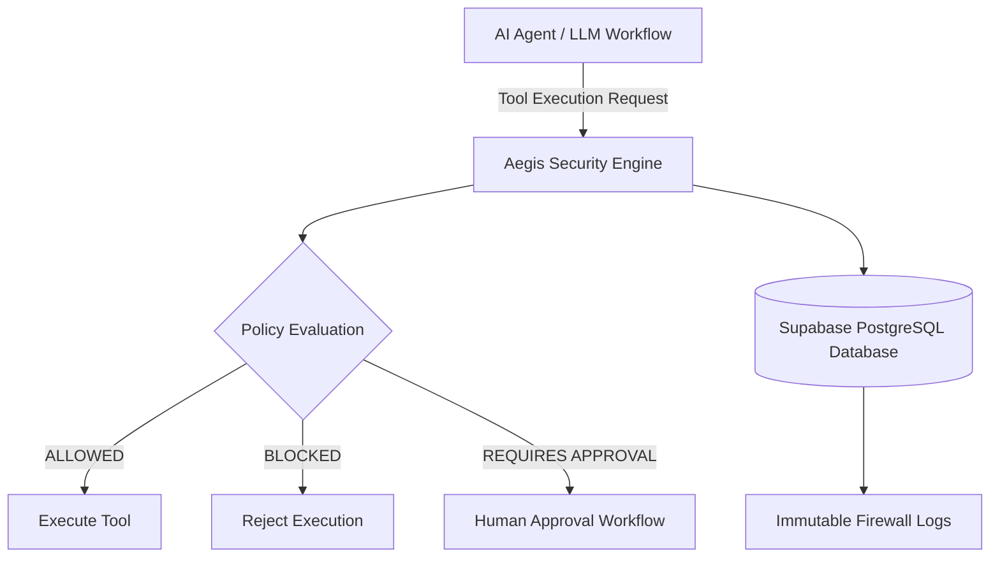

 🛡️ Aegis Tool Firewall

## Complete Technical & Enterprise Reference

Aegis is an enterprise-grade security middleware, interception engine, and real-time auditing platform designed to monitor, inspect, evaluate, and govern tool execution requests generated by autonomous AI agents, Large Language Model (LLM) pipelines, and distributed automation systems.

As AI systems gain access to sensitive environments including operating system commands, databases, APIs, and internal infrastructure, security risks such as prompt injection, unauthorized execution, data leakage, and uncontrolled automation become critical concerns.

Aegis introduces a security control layer between AI decision-making systems and external tool execution environments.

Every tool request passes through:

- Request interception
- Security policy evaluation
- Access validation
- Approval enforcement
- Immutable audit logging

Each operation receives a security verdict:

```
ALLOWED
BLOCKED
REQUIRES APPROVAL
```

---

# 📑 Table of Contents

- [Executive Summary](#1-executive-summary--core-purpose)
- [System Architecture](#2-complete-architecture--system-data-flow)
- [Feature Set](#3-comprehensive-feature-set)
- [Technology Stack](#4-technology-stack--exact-component-versions)
- [Prerequisites](#5-system-prerequisites--environment-requirements)
- [Project Structure](#6-detailed-project-directory-structure)
- [Installation](#7-installation--pypi-deployment-workflow)
- [Environment Configuration](#8-environment-configuration-secure-setup)
- [API Reference](#9-complete-api-reference-documentation)
- [AI Workflow Integration](#10-ai-workflow-integration--code-implementation)
- [Testing](#11-database-verification--testing-suite)

---

# 1. Executive Summary & Core Purpose

## What is Aegis?

**Aegis - The Tool Firewall** acts as a high-security execution gateway for modern AI architectures.

When an autonomous AI agent attempts to execute:

- System commands
- SQL queries
- File operations
- External API calls
- Infrastructure modifications

Aegis intercepts the request before execution.

The security engine then:

1. Captures execution telemetry
2. Validates request metadata
3. Evaluates security policies
4. Determines execution permissions
5. Records immutable audit logs

All security events are stored inside a cloud-backed PostgreSQL database.

---

# 2. Complete Architecture & System Data Flow

Aegis follows a decoupled architecture consisting of:

- AI Agent Integration Layer
- Security Interception Engine
- Policy Evaluation System
- Cloud Audit Database

## High-Level Architecture



---

## Internal Execution Pipeline

```text
┌──────────────────────────────────┐
│        AI Agent / Workflow       │
└────────────────┬─────────────────┘
                 │
                 │ Tool Execution Request
                 ▼

┌──────────────────────────────────┐
│       Aegis Security Engine      │
├──────────────────────────────────┤
│                                  │
│  • Request Interception           │
│  • Payload Inspection              │
│  • Policy Evaluation               │
│  • Security Verdict Generation    │
│                                  │
│  ALLOWED                         │
│  BLOCKED                         │
│  REQUIRES APPROVAL               │
│                                  │
└────────────────┬─────────────────┘
                 │
                 │ Secure Database Logging
                 ▼

┌──────────────────────────────────┐
│ Supabase Cloud PostgreSQL         │
│                                  │
│ Table: firewall_logs             │
└──────────────────────────────────┘
```

---

# End-to-End Execution Flow

## 1. Trigger Initiation

An automated workflow or autonomous AI agent prepares to execute a sensitive tool function.

---

## 2. Payload Interception

Aegis captures the function invocation payload at the execution boundary before any potentially destructive operation occurs.

---

## 3. Policy Evaluation

The security engine analyzes:

- Event metrics
- Request metadata
- Function parameters
- User permissions
- Security rules

---

## 4. Security Verdict Assignment

Every operation receives one of the following classifications:

| Verdict | Meaning |
|---|---|
| `ALLOWED` | Execution permitted |
| `BLOCKED` | Execution denied |
| `REQUIRES APPROVAL` | Human/system authorization required |

---

## 5. Database Persistence

Using a PostgreSQL database adapter (`psycopg2`), Aegis securely connects with the Supabase PostgreSQL instance and stores execution records inside the `firewall_logs` table.

---

## 6. Execution / Rejection

Based on the final verdict:

- Approved requests execute normally
- Blocked requests are rejected
- Sensitive operations trigger approval workflows
- Policy violations raise `PolicyViolationError`

---